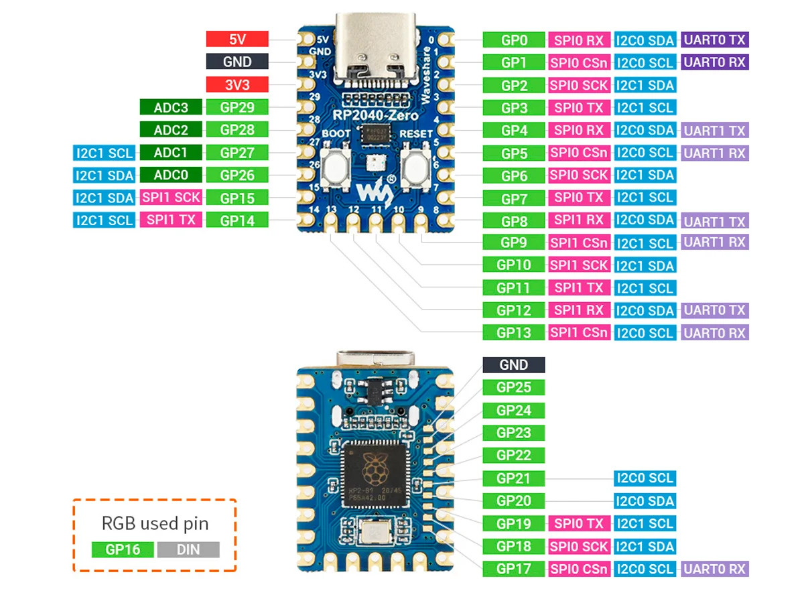

# Rubber Ducky para RP2040 Zero :duck:

Adaptação do [pico-ducky](https://github.com/dbisu/pico-ducky) de **dbisu** para o RP2040 Zero.
Projeto original em [pico-ducky-rp2040](https://github.com/sufigueroa/pico-ducky-RP2040-Zero)

## Instalação

- Mantenha pressionado o botão de boot enquanto conecta a placa ao PC.
- Arraste e solte o arquivo *uf2* (adafruit-circuitpython-waveshare_rp2040_zero-en_US-8.2.8).
- A placa irá reiniciar. Após isso, copie todo o conteúdo da pasta *src* para a placa.
- Agora ela deve funcionar :)

## Mais informações

O mapeamento dos pinos para esta placa é o seguinte.

Para o modo furtivo, adicione um jumper conectando o pino GP15 ao GND.

Caso algo dê errado na instalação, você pode restaurar as configurações de fábrica da placa mantendo pressionado o botão de boot e arrastando o arquivo *flash_nuke.uf2*.

## A FAZER:

- Permitir mais de um *payload*.
- Controlar o modo furtivo por meio de um interruptor.
- Selecionar o *payload* por meio de uma entrada.
